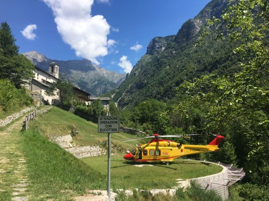
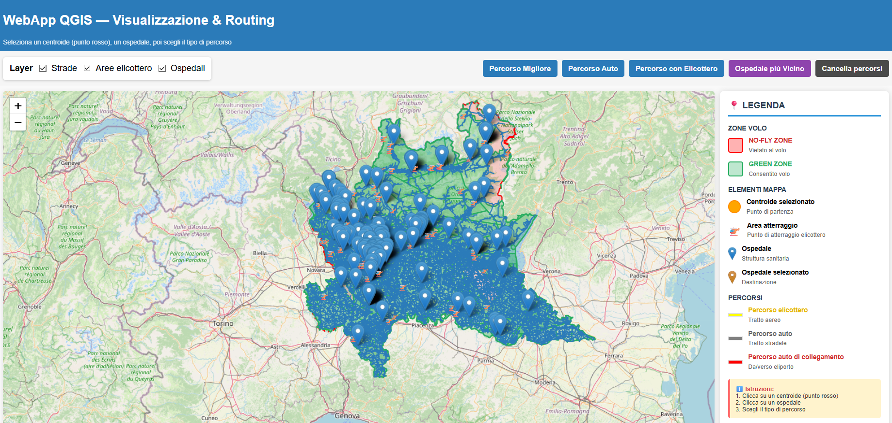
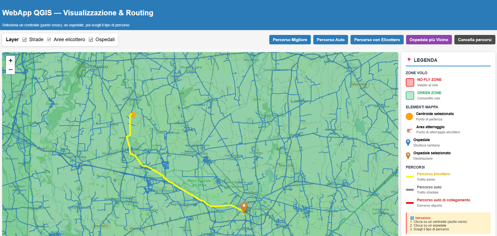
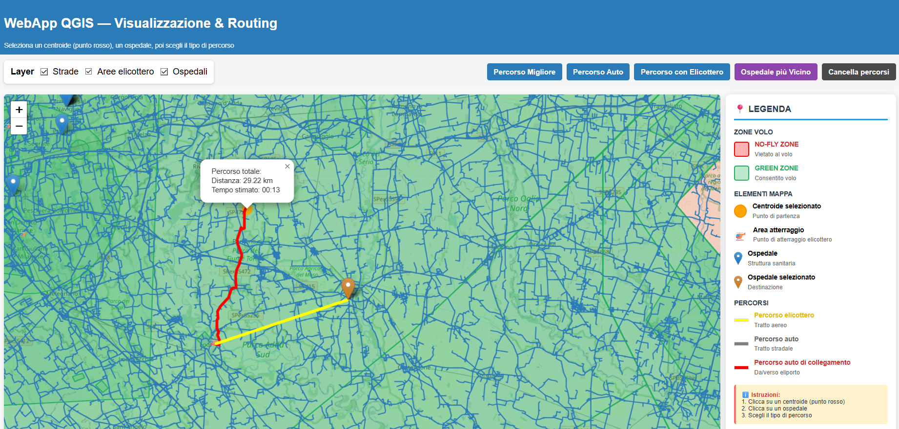
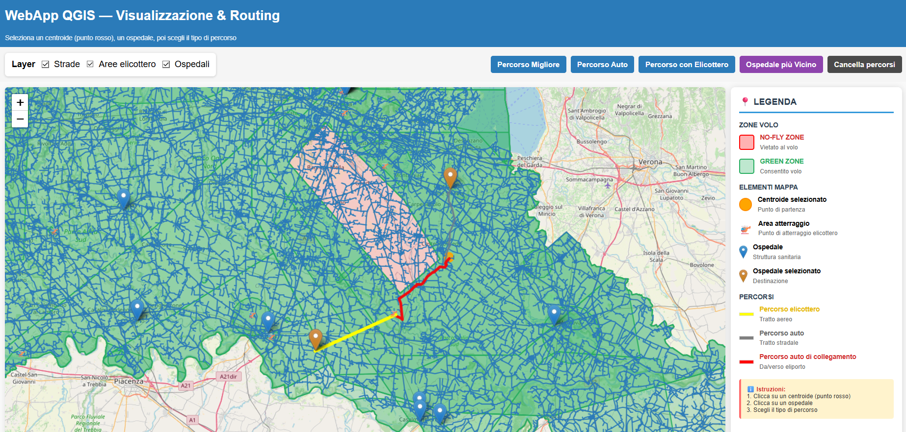
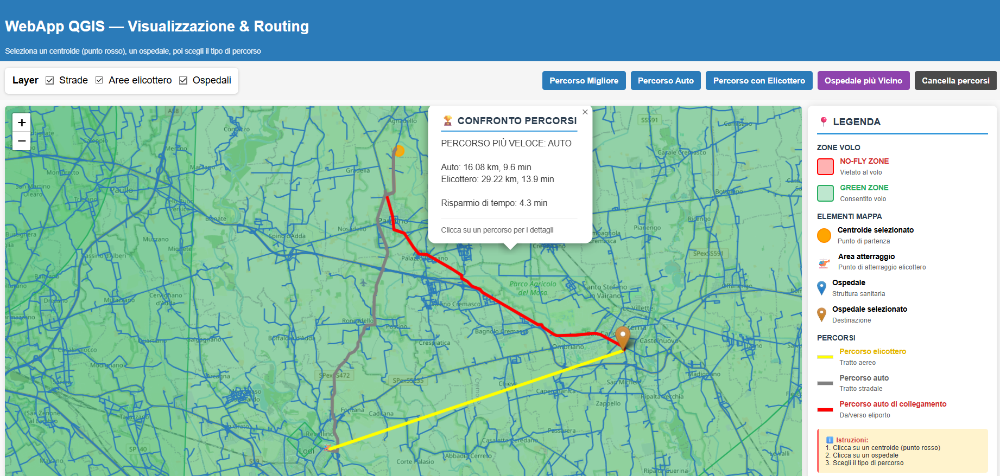

<div align="center">
  
</div>

# HeliPathGIS

A web-based Geographic Information System for emergency route optimization in the Lombardia region, Italy. HeliPathGIS calculates and compares the fastest routes to hospitals using both ground and air transportation. The application employs advanced pathfinding algorithms (Dijkstra for road networks, A* for aerial routes) while respecting no-fly zones and geographic constraints. Built with FastAPI and modern web technologies, it provides an interactive mapping interface for emergency response planning, helping to determine whether ground ambulance or helicopter evacuation is the optimal choice based on real-time calculations.

## Creating the Conda Environment

To set up the project environment using Conda and the provided requirements file:

```bash
# Create a new conda environment with Python 3.10
conda create -n helipathgis python=3.10

# Activate the environment
conda activate helipathgis

# Install all dependencies from requirements.txt
pip install -r requirements.txt
```

**Note:** Some packages in `requirements.txt` reference local conda builds. If you encounter errors, you may need to install them separately:

```bash
# Core dependencies
conda install -c conda-forge geopandas shapely pyproj networkx fastapi uvicorn
pip install torch torchvision torchaudio
```

## Cloning the Repository

Clone the repository and navigate to the project directory:

```bash
# Clone the repository
git clone https://github.com/yourusername/HeliPathGIS.git

# Navigate to project directory
cd HeliPathGIS
```

The application uses relative paths, so no additional configuration is needed. The paths are automatically set based on the project directory:

```python
# Paths are set automatically in app2.py
BASE_DIR = os.path.dirname(os.path.abspath(__file__))
DATA_DIR = os.path.join(BASE_DIR, "QGIS_file")
TEMPLATES_DIR = os.path.join(BASE_DIR, "templates")
```

## Features

### 1. Interactive Map Interface

The application provides an interactive web-based map powered by Leaflet.js, allowing users to visualize the road network, hospital locations, helipad positions, and no-fly zones across Lombardia.

<div align="center">
  
</div>

**Key capabilities:**
- Click to select start and end points
- Real-time route visualization
- Layer toggling for different map features
- Responsive design for desktop and mobile

### 2. Ground Route Calculation

Using Dijkstra's algorithm, the system calculates the optimal road-based route between any two points.

<div align="center">
  
</div>

The system converts the input coordinates to a metric reference, then computes the optimal route on the road network.
Once the path is reconstructed, it calculates total distance and travel time using a predefined average road speed.
The response is returned as map-ready geospatial data with route style and summary information.

**Technical features:**
- Pre-loaded road network graph for fast computation
- Real-time distance and time estimates
- Speed-adjusted calculations (default: 100 km/h)
- Visual route highlighting in yellow

**API Endpoint:**
```
POST /auto-path
```

### 3. Helicopter Route Calculation

The application computes helicopter routes using A* pathfinding algorithm with no-fly zone avoidance.

<div align="center">
  
</div>

The system converts start and destination to a metric space and computes an aerial route while respecting operational flight constraints.
The result is divided into the ground transfer and helicopter segment, each with its own distance and travel time.
The output also includes key points of the mission so the full emergency scenario is visible on one map.

**Technical features:**
- Dynamic grid generation for aerial pathways
- No-fly zone detection (airports, restricted areas, urban zones)
- Optimized flight paths with safety buffers
- Speed-adjusted calculations (default: 180 km/h)
- Visual route highlighting in blue

**API Endpoint:**
```
POST /heli-path
```

### 4. Combined Route Optimization

For helicopter routes, the system calculates the complete journey including:
1. Ground transportation from start point to nearest helipad
2. Helicopter flight from helipad to hospital
3. Total time comparison with ground-only route

<div align="center">
  
</div>

This view represents the two-leg mission logic: first ground movement to a reachable helipad, then flight to the destination.
Each leg is measured separately in terms of distance and duration, and then combined into a single end-to-end estimate.
This approach gives a realistic total mission time instead of evaluating only the airborne segment.

**Technical features:**
- Two-stage routing workflow (ground transfer + air segment)
- Independent distance/time computation for each mission leg
- Aggregated end-to-end metrics for complete mission evaluation
- Structured output ready for map visualization and comparison

### 5. Best Path Selection

The `/best-path` endpoint automatically compares both transportation methods and returns the fastest option.

<div align="center">
  
</div>

The comparison process aligns the origin to the nearest viable road point and evaluates both road-only and mixed road-air solutions.
It compares total durations and selects the faster option, while still returning both alternatives for transparency.
This keeps the decision explainable and supports a clear, data-driven recommendation.

**Comparison criteria:**
- Total travel time (including ground-to-helipad transfer)
- Distance optimization
- No-fly zone constraints
- Available helipad locations

**API Endpoint:**
```
POST /best-path
```

### 6. Performance Optimization

The application includes several performance enhancements:

**Backend optimizations:**
- Network graph caching in memory
- Spatial indexing with STRtree for fast geometric queries
- GPU acceleration support via PyTorch (when available)
- Simplified geometry rendering for reduced data transfer

**Frontend optimizations:**
- Progressive map layer loading
- GeoJSON data streaming
- Client-side route caching


### 7. Multi-Format Geospatial Data Support

The application handles various geospatial data formats:
- GeoJSON for web visualization
- GeoPackage (.gpkg) for complex datasets
- Shapefiles for legacy GIS data
- Coordinate system transformations (EPSG:4326 ↔ EPSG:32632)

## Running the Application

Start the FastAPI server:

```bash
# Standard mode
uvicorn app2:app --host 0.0.0.0 --port 8000

# Development mode with auto-reload
uvicorn app2:app --reload --host 0.0.0.0 --port 8000
```

Open your browser and navigate to:
```
http://localhost:8000
```

## Contributors

**Luca Giuliano** - Master's Degree Student in Computer Science, Data Science and Machine Learning

**Chiara Coscarelli** - Master's Degree Student in Computer Science, Data Science and Machine Learning